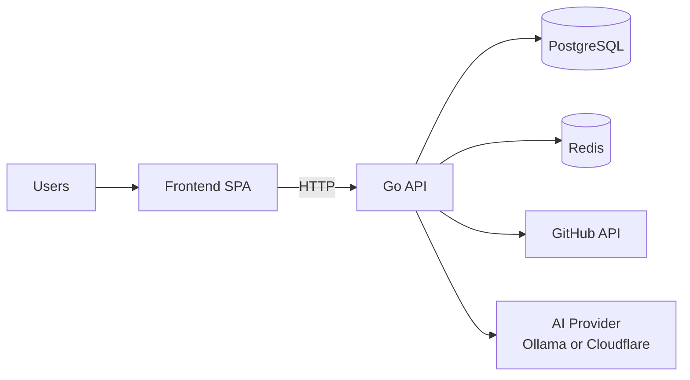

# Architecture Overview

## System Summary

Quizz is a full-stack quiz platform with:
- React + Redux frontend,
- Go (Gin) backend API,
- PostgreSQL as system-of-record,
- Redis as cache,
- Optional external integrations (GitHub sync, AI correction providers).

## High-Level Diagram

## Frontend Architecture

- Entry point: `frontend/src/main.jsx`
- Routing: `frontend/src/App.jsx`
- State store: `frontend/src/store.js`
- Feature modules:
  - `home`
  - `quiz`
  - `user`
  - `admin`
- Service layer:
  - `apiClient` (base HTTP abstraction)
  - topic/quiz/admin APIs

## Backend Architecture

- Entry point: `backend/cmd/api/main.go`
- Layering:
  - `handlers` (transport)
  - `services` (business logic)
  - `repository` (data access)
  - `models` (domain + DTOs)
  - `middleware`, `cache`, `metrics`, `logger`

## Data Architecture

- PostgreSQL tables:
  - topics
  - quizzes
  - questions
  - choices
  - attempts
- Migrations in `backend/migrations`.
- Redis used for cache and can support distributed concerns (rate limiting implementation exists).

## Integration Architecture

- GitHub source sync:
  - Pulls categories and markdown quiz content from upstream repository.
  - Parses, transforms, and stores into internal schema.
- AI-assisted correction:
  - Supports provider switching at runtime.
  - Used for automated question/answer quality workflows.

## Runtime and Deployment

- Development:
  - `deployment/docker-compose.development.yml`
- Production:
  - `deployment/docker-compose.prod.yml`
- Health probes:
  - `/health`
  - `/health/live`
  - `/health/ready`
- Metrics:
  - `/metrics`

## Architectural Strengths

- Clear layer separation in backend.
- Practical modularization in frontend features.
- Built-in support for external content ingestion.
- Existing metrics and health endpoints.

## Architectural Gaps to Address

- Security middleware enforcement across admin routes.
- Inconsistent frontend API access patterns.
- Partial middleware wiring for rate/security controls.
- Need for stricter production readiness gates.
