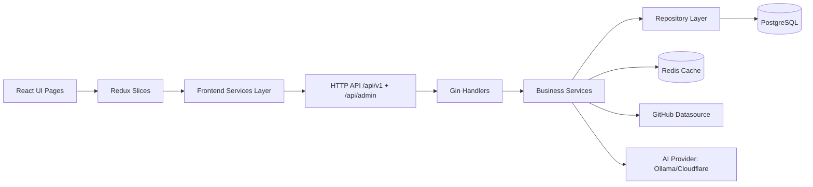

# Quizz Codebase Scan (Dependency Map)

Last updated: 2026-04-05
Scope: frontend, backend, deployment, and test strategy.

## 1) Detailed Dependency Map (Frontend -> Backend -> Data and External Systems)

### 1.1 System flow overview

### 1.2 Frontend chain (service-by-service)

- App bootstrap:
  - `frontend/src/main.jsx`: React root and Redux Provider.
  - `frontend/src/App.jsx`: router tree for public and admin flows.

- State layer:
  - `frontend/src/store.js`: combines `home`, `quiz`, and `auth` reducers.
  - `frontend/src/features/quiz/quizSlice.js`:
    - Uses `topicsApi` and `quizzesApi` for part of the data flow.
    - Still contains direct `fetch(...)` calls in random quiz paths (bypasses `apiClient`).

- API client layer:
  - `frontend/src/services/apiClient.js`: base URL from `config.API_BASE`, same-origin fallback (`/api/v1`), fallback retry for network errors.
  - `frontend/src/services/topicsApi.js`: topics and quizzes-by-topic.
  - `frontend/src/services/quizzesApi.js`: quiz detail, questions, attempts.
  - `frontend/src/services/adminApi.js`: quiz/topic CRUD + sync/correction/AI settings (mixed usage of `apiClient` and direct `fetch`).
  - `frontend/src/services/api.js`: high-level facade + legacy `getQuiz()` compatibility function.

### 1.3 Backend chain (service-by-service)

- App bootstrap and dependency wiring:
  - `backend/cmd/api/main.go`:
    - Loads config (`pkg/utils/config.go`).
    - Initializes DB (GORM/PostgreSQL), Redis, and memory cache fallback when Redis is unavailable.
    - Initializes handlers, services, and repositories.
    - Registers routes and middleware.

- Middleware currently attached to router:
  - `middleware.CORS()`
  - `metrics.PrometheusMiddleware()`
  - `middleware.RequestLoggingMiddleware()`
  - `gin.Recovery()`

- Route groups:
  - Public routes:
    - `/api/v1/topics`
    - `/api/v1/topics/:topic/quizzes`
    - `/api/v1/topics/:topic/questions/random`
    - `/api/v1/quizzes/:slug`
    - `/api/v1/quizzes/:slug/questions`
    - `/api/v1/quizzes/:slug/attempts` (POST/PUT/GET)
  - Admin routes:
    - `/api/v1/admin/...` (topic/quiz CRUD)
    - `/api/admin/...` (GitHub sync, image download, question correction, AI settings)

- Service and infrastructure dependencies:
  - Topic flow:
    - `TopicHandler` -> `TopicService` -> `TopicRepository` -> PostgreSQL + Cache.
  - Quiz flow:
    - `QuizHandler` -> `QuizService` -> `QuizRepository` -> PostgreSQL + Cache.
  - Attempt flow:
    - `AttemptHandler` -> `AttemptService` -> `AttemptRepository` + `QuizService` -> PostgreSQL + Cache.
  - Admin flow:
    - `AdminHandler` -> `AdminService` + `GitHubSyncService` + `QuestionCorrector`.
    - `GitHubSyncService` -> `datasources.GitHubClient` -> GitHub API repo `your-org/quiz-content-source`.
    - `QuestionCorrector` -> DB + GitHub client + AI answer service (Ollama/Cloudflare).

### 1.4 Data and external systems

- PostgreSQL:
  - Migrations in `backend/migrations` cover topics, quizzes, questions, choices, attempts, external-source fields, and correction metadata.
- Redis:
  - Used for caching.
  - A `RateLimiter` exists (`internal/middleware/rate_limit.go`) but is not clearly wired into startup routing.
- External integrations:
  - GitHub API via Resty client (`internal/services/datasources/github_client.go`).
  - AI provider configuration and updates in admin handler (`internal/handlers/admin.go`).

### 1.5 Deployment wiring

- Development compose: `deployment/docker-compose.development.yml`
  - Frontend on 5173, backend on 8080, PostgreSQL, Redis, Adminer, Redis Commander.
- Production compose: `deployment/docker-compose.prod.yml`
  - Frontend/backend images from GHCR, PostgreSQL, Redis, Nginx.

---
